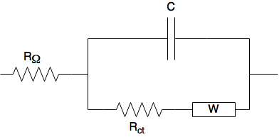

# Electrochemical Impedance Spectroscopy - Interactive Simulations

This directory contains an set of interactive visualizations (created with [ipywidgets]() and [nbinteract]()) of the frequency dependent impedance (we'll use the symbol Z for impedance) of a few equivalent circuit models commonly encountered in electrochemical impedance spectroscopy.

It is currently under construction, so not much material lives here at the moment.

The impedance data is generally visualized using different 2D representations such as:
* **Complex plane plot** (or a Nyquist plot) where the real ($Z_{re}$) and imaginary ($Z_{im}$) part of the impedance is displayed. Most often the negative of the imaginary that is plotted on the y-axis (*i.e.* - $Z_{im}$) in such a plot.

* a **Bode plot**, which is a plot with the logarithm of the frequency ($log\,f$) on the x-axis in one of the following combinations:
    * the modulus of the logarithm ($log_{10}$) of the impedance ($Z_{mod}$) and the phase angle ($\phi$) *vs* $log\ f$
    * $Z_{re}$ and $-Z_{im}$ *vs* $log\,f$
    * $log\,Z_{re}$ and $log\,|Z_{im}|$ *vs* $log\,f$

The circuits are described using a text string that can (unambiguously) describe the way the circuit is connected. It is closely following that suggested by B. Boukamp in his [Circuit Description Code (CDC)](https://www.utwente.nl/en/tnw/ims/publications/downloads/CDC_Explained.pdf).

The image below shows a circuit diagram illustrating the well-known Randles circuit, where $R_{\Omega}$ is the ohmic resistance (e.g. the uncompensated electrolyte resistance in a three-electrode cell), $R_{ct}$ is the charge transfer resistance, C is the double-layer capacitance, and W is a semi-infinite Warburg diffusion element.

Using the CDC we can describe the Randles circuit as "R(C\[RW\])". This type of string representation is helpful when one wants to instruct a computer program what circuit to build or select for fitting of a model to experimental impedance data, and also useful to discuss different circuits in text.

** Things to implement **

* move all impedance functions and interact wrappers to a script that is imported into notebook to unclutter, but add MathJax equations for all cases
* hmm, now I am thinking that simulations should also be split over several notebooks/html docs...
* a R(RC) circuit
* a R(C[RW]) circuit where W is a semi-infite Warburg diffusion element
* a R(C[RW]) circuit where W is a 1D finite-length diffusion element with a blocking boundary (to illustrate response in thin-layer cell)
* a R(C[RW]) circuit in the context of an RDE experiment, in this case it is a finite-length diffusion element with a transmissive boundary
* a Transmission Line Circuit Model / Porous Electrode example (maybe this should be a separate notebook/html)
* a concentration profile in EIS experiment where frequency can be varied to illustrate "probing depth" / penetration length in EIS